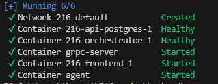
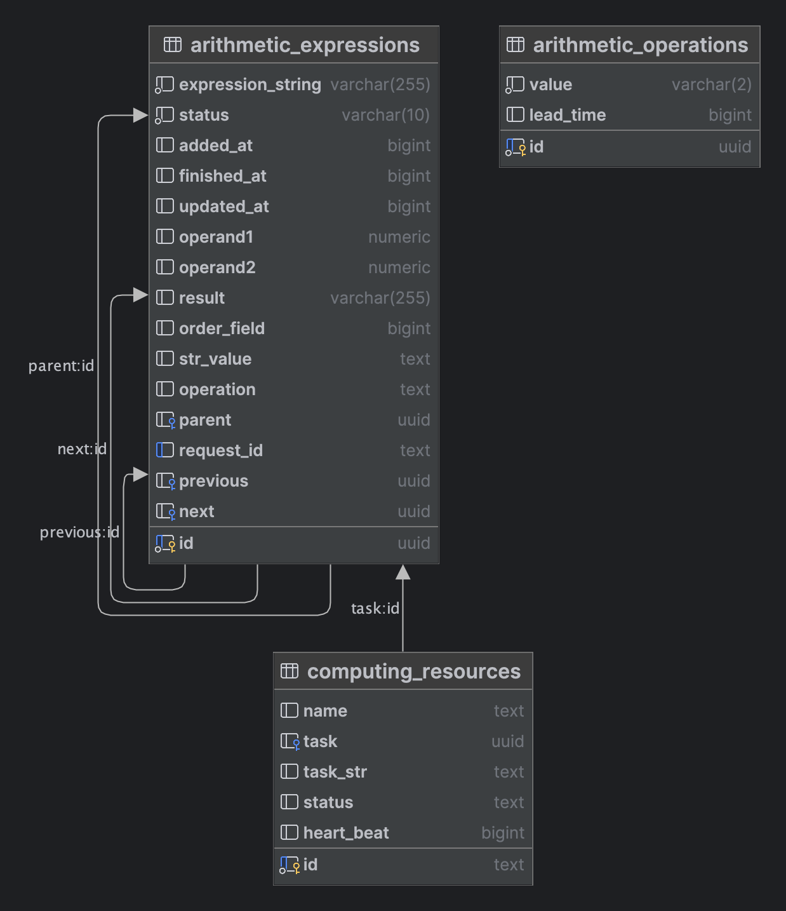

# Распределенный вычислитель арифметических выражений

Состоит из Front-end и Back-end частей. Grpc server и agent .

## Установка и запуск
1. 
```
git clone https://github.com/Saundq/216.git
```
2. 
```
docker-compose build
```
3. 
```
docker compose up -d
```
4. 


После запуска всех контейнеров будет доступен интерфейс
[http://localhost:5175](http://localhost:5175/)
```  
	  email: admin@test.ru 
	  password: admin
```

Весь реализованный ранее функционал работает как раньше, только в контексте конкретного пользователя
Выражения хранятся в Postgres работа с БД произовдится через ORM Gorm.
Общение вычислителя и сервера вычислений переведено на GRPC.
Тестами покрыт код отвечающий за работу с математическими выражениями и пользователями.


## Запуск тестов
 
из папки backend 

windows
```
go test  -v  .\tests\
```
unix
```
go test -v tests/* 
```

## Принцип работы
По адресу [http://localhost:5175 доступен frontend](http://localhost:5175/)
Позволяющий отправить идемпотентный запрос на сервер с математическим выражением на решение. Идемпотентность достигается добавлением в заголовок запроса X-Request-ID с хешем математического выражения. При повторной отправке выражения сервер вернет 200 или 200 с ответом.
Данные отправляются POST запросом на сервер

По адресу [http://localhost:5175/registration доступна регистрация ](http://localhost:5175/registration)

По адресу [http://localhost:5175/expressions cтраница со списком выражений](http://localhost:5175/expressions) с информацией о
статусе, дате создания и заверщения вычисления
Страница получает данные GET запросом

По адресу [http://localhost:5175/operations cтраница со списком операций](http://localhost:5175/operations) с информацией о имени операции и времени его выполнения (доступное для редактирования поле)
Страница получает данные GET запросом

По адресу [http://localhost:5175/computing_capabilities страница со списком вычислительных можностей](http://localhost:5175/computing_capabilities) с информацией о имени вычислительного ресурса и выполняемой на нём операции
Страница получает данные GET запросом


При добавлении математического выражения (операнды и операторы разделяются пробелом) на вычисление, оркестратор переводит его в постфиксную форму и разбивает на мелкие дочерние мат. выражения. Получаем не зависимые и зависимы выражения.

  
   bakend           -----API-http-----  frontend


   orchestrator     -----GRPC-----      agent

Проверяется наличие выражения для расчета и при их наличии инициирует расчет через grpc.  Первоочередно расчитываются не зависимые выражения. Проставляется информация для вычислительного реурса, выполняется вычисление с указанной задержкой и проставляется результат c округлением до второго знака. Если посчитаны все дочерние мат. выражения, то проставляется результат для всего выражения.


При остановке и последующем его запуске все выражения со статусом progress возвращаются в статут wait и сново доступны для вычисления. 

Все endpoint-ы оркестратора описаны в файле api.http

## Схема БД


## Доступные операции

| + |
|-| 
| - |
| / |
| * |
| () |

## Примеры

| Мат. выражение                                                                        | Результат |
|---------------------------------------------------------------------------------------|-----------|
| ( 3 + 3 ) * 4 / 1 + 1 - 1 + ( 3 - 2 ) - 8 - 1                                         | 16        |
| ( 3 + 3 ) * 4 / 1 + 1 - 1 - ( 6 + 1 ) + 8                                             | 25        |
| 9 / 5 + 6 * 7 + 23 - 3                                                                | 63.8      |
| 3 - 1 + ( 4 * 53 ) / 4 - 3 + ( ( 23 - 1 ) + ( 7 + 3 ) * 2 )                           | 94        |        
| ( ( 7 + 3 ) / 3 ) - 4 + ( 15 - 4 ) / 3 + 21 * 4 - ( ( 8 - 3 ) * 2 )                   | 77        |        
| 2 * 2                                                                                 | 4         |         
| 2 * 2 + 2                                                                             | 6         |         
| 2 * ( 2 + 1 )                                                                         | 6         |         
| 2 * ( ( 2 - 1 ) * 3 )                                                                 | 6         |
| 3 * ( 4 + 5 ) * ( ( 3 - 3 * ( ( 4 + 5 ) / ( 3 - 2 ) ) ) ) * 5 - ( ( 7 + 4 ) - 8 ) / 2 | -3241.5   |
